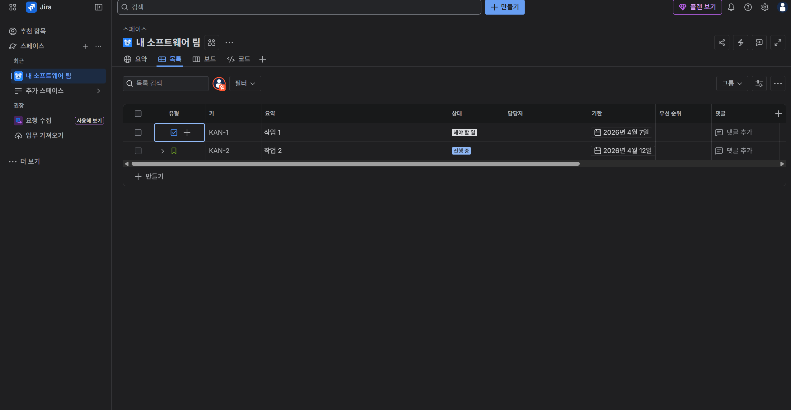
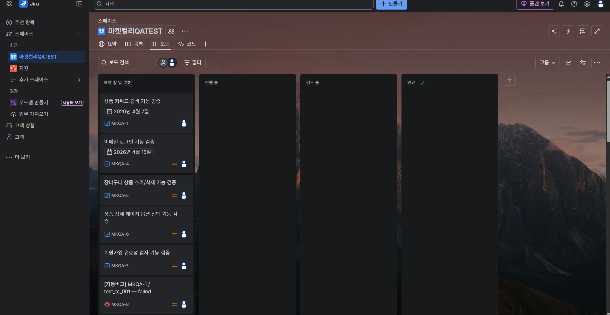
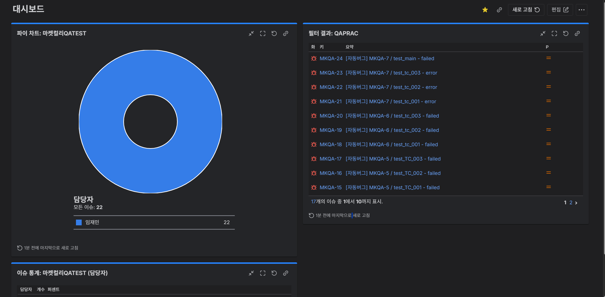
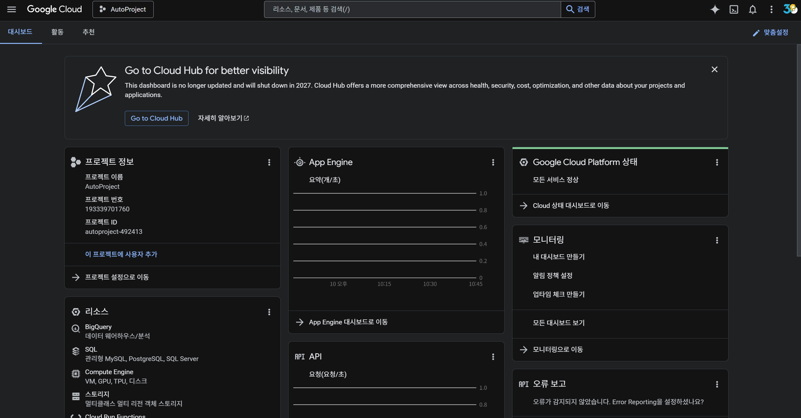

# AI 기반 QA 자동화 파이프라인

> Jira 티켓을 기반으로 AI가 테스트 케이스를 자동 생성하고,  
> Selenium으로 실행 후 결과를 Jira · Google Sheets · Slack에 자동 연동하는 QA 자동화 파이프라인

---

## 파이프라인 전체 흐름

```
Jira TC 티켓 조회
       ↓
Groq AI (LLaMA 3.3 70B) → 매뉴얼 TC 자동 생성
       ↓
Groq AI → Selenium pytest 코드 자동 변환
       ↓
pytest 실행 + 결과 JSON 저장
       ↓
실패 TC → Jira 버그 티켓 자동 등록 (중복 방지)
       ↓
Google Sheets 동기화 (TC 목록 + 실행 결과 + 버그 링크)
       ↓
Slack 결과 알림 전송
       ↓
HTML 대시보드 생성 (SVG 도넛 차트)
```

---

## 사용 기술

| 항목 | 기술 |
|------|------|
| AI 모델 | Groq API (LLaMA 3.3 70B) |
| 테스트 자동화 | Selenium + pytest + webdriver-manager |
| 이슈 관리 | Jira REST API |
| 결과 리포팅 | Google Sheets API (gspread) |
| 알림 | Slack Incoming Webhook |
| 언어 | Python 3 |
| 환경변수 | python-dotenv |

---

## 프로젝트 구조

```
AutoProject/
├── src/
│   ├── generate_tc.py         # Jira 티켓 → AI 매뉴얼 TC 생성
│   ├── generate_selenium.py   # 매뉴얼 TC → Selenium pytest 코드 변환
│   ├── run_tests.py           # pytest 실행 + 결과 JSON 저장
│   ├── create_jira_bugs.py    # 실패 TC → Jira 버그 티켓 자동 등록
│   ├── sync_sheets.py         # Google Sheets 동기화
│   ├── notify_slack.py        # Slack 결과 알림
│   ├── generate_dashboard.py  # HTML 대시보드 생성
│   ├── create_jira_filters.py # Jira JQL 필터 생성
│   ├── test_groq.py           # Groq API 연결 테스트
│   └── test_jira.py           # Jira 연동 테스트
├── tests/                     # AI가 생성한 Selenium 테스트 코드
├── reports/                   # TC JSON, 실행 결과 JSON, HTML 대시보드
├── pipeline.py                # 전체 파이프라인 순차 실행
├── requirements.txt
└── .env                       # API 키 (gitignore 처리)
```

---

## 환경 설정

### 1. 패키지 설치

```bash
pip install -r requirements.txt
```

### 2. `.env` 파일 설정

```env
GROQ_API_KEY=your_groq_api_key
JIRA_URL=https://your-domain.atlassian.net
JIRA_EMAIL=your_email@example.com
JIRA_API_TOKEN=your_jira_api_token
JIRA_PROJECT_KEY=your_project_key
SLACK_WEBHOOK_URL=https://hooks.slack.com/services/...
GOOGLE_CREDENTIALS_PATH=credentials.json
SPREADSHEET_ID=your_spreadsheet_id
```

### 3. Google Sheets 서비스 계정 설정

1. Google Cloud Console에서 서비스 계정 생성
2. `credentials.json` 발급 후 프로젝트 루트에 위치
3. 대상 스프레드시트에 서비스 계정 이메일 공유

---

## 실행 방법

### 전체 파이프라인 한 번에 실행

```bash
python pipeline.py
```

### 개별 스텝 실행

```bash
# 1. Jira 기반 TC 생성
python src/generate_tc.py

# 2. Selenium 코드 자동 생성
python src/generate_selenium.py

# 3. pytest 실행
python src/run_tests.py

# 4. Jira 버그 등록
python src/create_jira_bugs.py

# 5. Google Sheets 동기화
python src/sync_sheets.py

# 6. Slack 알림
python src/notify_slack.py

# 7. HTML 대시보드 생성
python src/generate_dashboard.py
```

---

## 주요 기능 상세

### AI TC 자동 생성 (`generate_tc.py`)
- Jira 프로젝트에서 TC 티켓 목록 조회
- Groq LLaMA 모델에 티켓 정보 전달
- 테스트 목적 / 사전 조건 / 테스트 단계 / 기대 결과 형식으로 TC 생성
- `reports/tc_날짜시간.json` 저장

### AI Selenium 코드 변환 (`generate_selenium.py`)
- 생성된 TC JSON을 Groq AI에 전달
- Selenium + pytest 형식의 자동화 코드로 변환
- `tests/test_티켓키.py` 파일로 저장

### Jira 버그 자동 등록 (`create_jira_bugs.py`)
- pytest 실패 결과를 파싱하여 Jira 버그 티켓 자동 생성
- 동일 TC의 중복 티켓 생성 방지 (기존 티켓 조회 후 스킵)
- 버그 티켓에 TC 정보 · 실패 원인 자동 기재

### Google Sheets 동기화 (`sync_sheets.py`)
- TC 목록, 실행 결과, Jira 링크 통합 관리
- PASS/FAIL 상태 색상 표시
- 요약 시트: 전체 / 통과 / 실패 / 통과율 / 버그 수

### HTML 대시보드 (`generate_dashboard.py`)
- SVG 도넛 차트로 PASS/FAIL 시각화
- 실행 결과 테이블 및 요약 정보 포함
- `reports/dashboard_날짜시간.html` 생성

---

## Jira 프로젝트 구성

- **프로젝트**: MKQA (마켓컬리 QA)
- **TC 티켓**: MKQA-1 ~ 7 (기능 검증 TC)
- **버그 티켓**: 자동 생성 (Selenium 실패 결과 기반)
- **대시보드 가젯**: 파이 차트 / 필터 결과 / 이슈 통계 / 생성 대비 해결 차트

---

## 스크린샷

| 항목 | 이미지 |
|------|--------|
| 파이프라인 실행 |  |
| Jira 메인 |  |
| Jira 대시보드 |  |
| Google Sheets |  |
